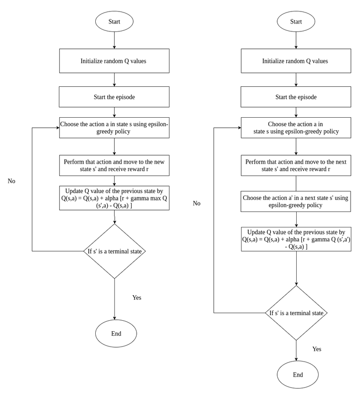

# Q-Learning & SARSA

## Define

$$
Q(s_t, a_t) \leftarrow Q(s_t, a_t) + \alpha [r_{t+1} + \gamma \max_{a} Q(s_{t+1}, a) - Q(s_t, a_t)]
$$

[Value-Based_Methods.md](./Value-Based_Methods.md)
$$
Q(s_t, a_t) \leftarrow Q(s_t, a_t) + \alpha [r_{t+1} + \gamma Q(s_{t+1}, a_{t+1}) - Q(s_t, a_t)]
$$

State-Action-Reward-State-Action (SARSA) is an on-policy learner.

