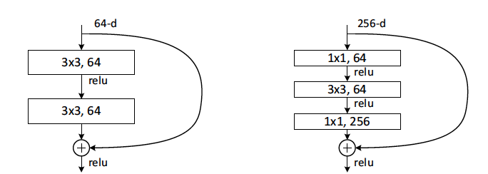

# ResNet

[TOC]

## Define



## Implement

```python
import torch
import torch.nn as nn

class BasicBlock(nn.Module):
    expansion = 1

    def __init__(self, in_channels, out_channels, stride=1, downsample=None):
        super(BasicBlock, self).__init__()
        self.conv1 = nn.Conv2d(in_channels, out_channels, kernel_size=3, stride=stride, padding=1, bias=False)
        self.bn1 = nn.BatchNorm2d(out_channels)
        self.relu = nn.ReLU(inplace=True)
        self.conv2 = nn.Conv2d(out_channels, out_channels, kernel_size=3, stride=1, padding=1, bias=False)
        self.bn2 = nn.BatchNorm2d(out_channels)
        self.downsample = downsample

    def forward(self, x):
        identity = x

        out = self.conv1(x)
        out = self.bn1(out)
        out = self.relu(out)

        out = self.conv2(out)
        out = self.bn2(out)

        if self.downsample is not None:
            identity = self.downsample(x)

        out += identity
        out = self.relu(out)

        return out

# 示例ResNet层
class ResNetLayer(nn.Module):
    def __init__(self, block, in_channels, out_channels, blocks, stride=1):
        super(ResNetLayer, self).__init__()
        downsample = None
        if stride != 1 or in_channels != out_channels * block.expansion:
            downsample = nn.Sequential(
                nn.Conv2d(in_channels, out_channels * block.expansion, kernel_size=1, stride=stride, bias=False),
                nn.BatchNorm2d(out_channels * block.expansion),
            )

        layers = []
        layers.append(block(in_channels, out_channels, stride, downsample))
        for _ in range(1, blocks):
            layers.append(block(out_channels * block.expansion, out_channels))

        self.layer = nn.Sequential(*layers)

    def forward(self, x):
        return self.layer(x)

# 完整的ResNet
class ResNet(nn.Module):
    def __init__(self, block, layers, num_classes=1000):
        super(ResNet, self).__init__()
        self.in_channels = 64
        self.conv1 = nn.Conv2d(3, self.in_channels, kernel_size=7, stride=2, padding=3, bias=False)
        self.bn1 = nn.BatchNorm2d(self.in_channels)
        self.relu = nn.ReLU(inplace=True)
        self.maxpool = nn.MaxPool2d(kernel_size=3, stride=2, padding=1)
        self.layer1 = ResNetLayer(block, self.in_channels, 64, layers[0])
        self.layer2 = ResNetLayer(block, 64 * block.expansion, 128, layers[1], stride=2)
        self.layer3 = ResNetLayer(block, 128 * block.expansion, 256, layers[2], stride=2)
        self.layer4 = ResNetLayer(block, 256 * block.expansion, 512, layers[3], stride=2)
        self.avgpool = nn.AdaptiveAvgPool2d((1, 1))
        self.fc = nn.Linear(512 * block.expansion, num_classes)

    def forward(self, x):
        x = self.conv1(x)
        x = self.bn1(x)
        x = self.relu(x)
        x = self.maxpool(x)

        x = self.layer1(x)
        x = self.layer2(x)
        x = self.layer3(x)
        x = self.layer4(x)

        x = self.avgpool(x)
        x = torch.flatten(x, 1)
        x = self.fc(x)

        return x

# 构建ResNet实例（例如：ResNet-18）
resnet18 = ResNet(BasicBlock, [2, 2, 2, 2])

```

