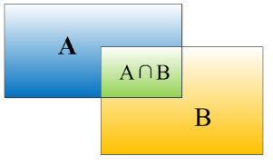

# Object Detection

[TOC]

## 评价指标

- **准确度（Accuracy）**: 表示模型正确分类的样本与总样本数的比例。
- **精确率（Precision）**: 表示被预测为正类中实际为正类的比例，即真正例的数量除以真正例和假正例之和。
- **召回率（Recall）**: 表示所有正类样本中，被模型正确识别出的比例。
- **AP（Average Precision）**: 用于衡量目标检测算法在单个类别上的性能，通常在多个召回率下的精确率的平均值。
- **mAP（mean Average Precision）**: 当涉及多个类别时，AP的平均值，常用于比较目标检测算法的整体性能。
- **IoU** (Intersection over Unio): 定义了两个bounding box的重叠度

$$
\text{IOU} = \frac{A \cap B}{A \cup B}
$$

