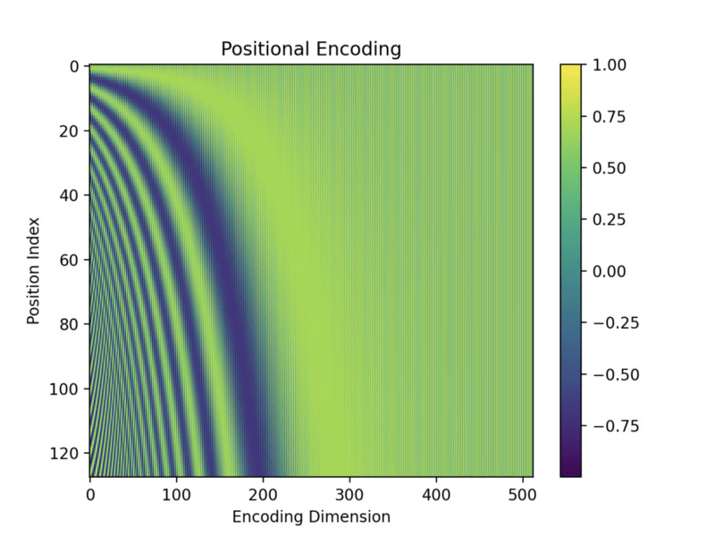
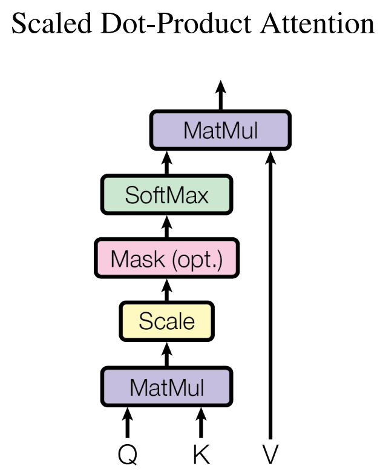
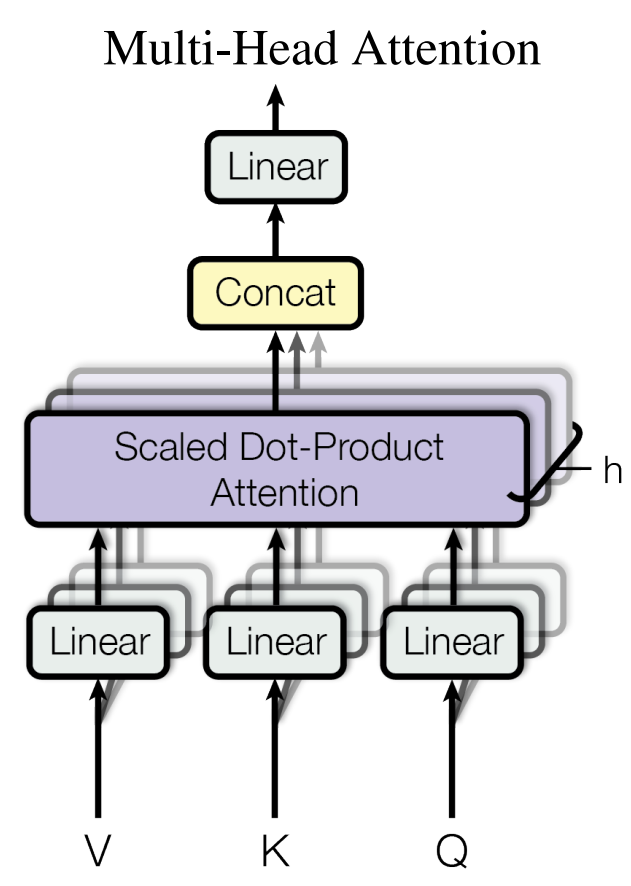
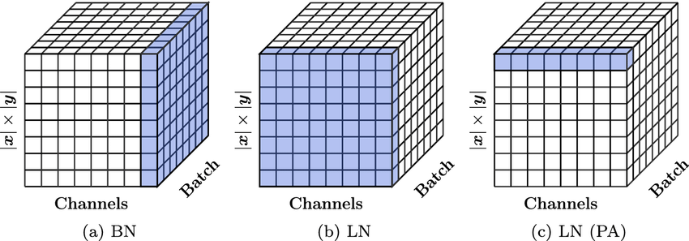

# $Attention\ is\ all\ you\ need$
[TOC]

# Process

## Inputs Embedding

### Positional Encoding

$$\boldsymbol p_{t} = \left\{\begin{matrix} \sin(\omega_k t)  &\quad, \text{if } i = 2k \\  \cos(\omega_k t)  &\quad, \text{if } i = 2k + 1 \\   \end{matrix}\right. \in \mathbb R^{d_{model}}$$

$$\omega_k = \left(\frac{1}{10000}\right)^{\frac{2 k}{d_{model}}}$$



```python
class PostionalEncoding(nn.Module):
    def __init__(self, d_model, max_len, device):
        super(PostionalEncoding, self).__init__()
        self.encoding = torch.zeros(max_len, d_model, device=device)
        self.encoding.requires_grad = False
    
    	pos = torch.arange(0, max_len, device=device)
    	pos = pos.float().unsqueeze(dim=1)

    	_2i = torch.arange(0, d_model, step=2, device=device).float()

    	self.encoding[:, 0::2] = torch.sin(pos / (10000 ** (_2i / d_model)))
    	self.encoding[:, 1::2] = torch.cos(pos / (10000 ** (_2i / d_model)))

    def forward(self, x):
    	batch_size, seq_len = x.size()
    	return self.encoding[:seq_len, :]
```

## Mask

In Self Attention, Mask is used to restrict which positions of information are considered when calculating attention weights to achieve specific operations on the sequence. In the Transformer model, two types of masks are commonly used: Padding Mask and Sequence Mask.

### Padding Mask

In self attention, the length of the input sequence may be inconsistent. To make calculations more efficient and avoid unnecessary calculations, we usually pad the shorter sequence to make it equal in length to the longest sequence. The filled parts do not contain actual information, so when calculating attention weights, it is necessary to mask these filled positions, that is, set the weights of the corresponding positions to negative infinity (or very small values).

```
padding_value = float('-inf')
masked_input = input_tensor.masked_fill(mask.unsqueeze(-1) == 0, padding_value)
```

### Sequence Mask

In some cases, we need to limit Self Attention to only focus on information before the current position, without considering information after the current position. This is typically used to solve autoregressive tasks, such as language models, where the model needs to generate the next word based on previous generation results.

```
T = input_tensor.size(0)
seq_mask = torch.triu(torch.ones(T, T), diagonal=1)  # 上三角矩阵
seq_mask = seq_mask.to(dtype=torch.bool)  # 转换为布尔类型

masked_input = input_tensor.masked_fill(seq_mask, 0)
```

## Self-Attention

$$\text{Attention}(Q, K, V) = \text{softmax}\left(\frac{Q K^T}{\sqrt{d_k}}\right) V$$



1. `Matmul`: $Q K^T$
2. `Scale`: $\frac{\cdot}{\sqrt{d_k}}$
3. `Masking (opt)`
4. `Softmax`: $\text{softmax}(\cdot)$
5. `Matmul`: $\cdot V$

```python
class ScaleDotProductAttention(nn.Module):
  
    def __init__(self):
        super(ScaleDotProductAttention, self).__init__()
        self.softmax = nn.Softmax()

    def forward(self, q, k, v, mask=None, e=1e-12):
        batch_size, head, length, d_tensor = k.size()

        # 1. Matmul & Scale
        k_t = k.view(batch_size, head, d_tensor, length) 
        score = (q @ k_t) / math.sqrt(d_tensor) 

        # 2. Masking (opt)
        if mask is not None:
            score = score.masked_fill(mask == 0, -e)

        # 3. Softmax
        score = self.softmax(score)

        # 4. Matmul
        v = score @ v

        return v, score
```

## Multi-Headed Attention



1. Linear
2. Scaled dot product attention
3. Concat
4. Linear

```python
class MultiHeadAttention(nn.Module):
    def __init__(self, model_dim, n_head, dropout_rate):
        super(MultiHeadAttention, self).__init__()

        self.model_dim = model_dim
        self.n_head = n_head
        self.head_dim = self.model_dim // self.n_head

        self.linear_k = nn.Linear(self.model_dim, self.head_dim * self.n_head) 
        self.linear_v = nn.Linear(self.model_dim, self.head_dim * self.n_head) 
        self.linear_q = nn.Linear(self.model_dim, self.head_dim * self.n_head)

        self.linear_final=nn.Linear(self.head_dim * self.n_head, self.model_dim)
        self.dropout = nn.Dropout(dropout_rate)
        self.scaled_dot_product_attention = ScaledDotProductAttention(dropout_rate)


    def forward(self, query, key, value, mask=None):
        q = self.linear_q(query) 
        k = self.linear_k(key)
        v = self.linear_v(value)
        batch_size=k.size()[0]

        q_ = q.view(batch_size * self.n_head, -1, self.head_dim) 
        k_ = k.view(batch_size * self.n_head, -1, self.head_dim)
        v_ = v.view(batch_size * self.n_head, -1, self.head_dim)

        context = self.scaled_dot_product_attention(q_, k_, v_, mask) 

        output = context.view(batch_size, -1, self.head_dim * self.n_head) 
        output = self.linear_final(output)
        output = self.dropout(output)
        return output
```

## Feed-Forward Network

```python
class PositionwiseFeedForward(nn.Module):

    def __init__(self, d_model, hidden, drop_prob=0.1):
        super(PositionwiseFeedForward, self).__init__()
        self.linear1 = nn.Linear(d_model, hidden)
        self.linear2 = nn.Linear(hidden, d_model)
        self.relu = nn.ReLU()
        self.dropout = nn.Dropout(p=drop_prob)

    def forward(self, x):
        x = self.linear1(x)
        x = self.relu(x)
        x = self.dropout(x)
        x = self.linear2(x)
        return x
```

## Layer Normalisation

Layer Normalization is a regularization technique used in deep learning to accelerate and stabilize the training process. Its main purpose is to normalize inputs at each layer of the neural network to reduce internal covariate shift issues.



```python
class LayerNorm(nn.Module):
    def __init__(self, d_model, eps=1e-12):
        super(LayerNorm, self).__init__()
        self.gamma = nn.Parameter(torch.ones(d_model))
        self.beta = nn.Parameter(torch.zeros(d_model))
        self.eps = eps

    def forward(self, x):
        mean = x.mean(-1, keepdim=True)
        std = x.std(-1, keepdim=True)

        out = (x - mean) / (std + self.eps)
        out = self.gamma * out + self.beta
        return out
```

# Train & Test

