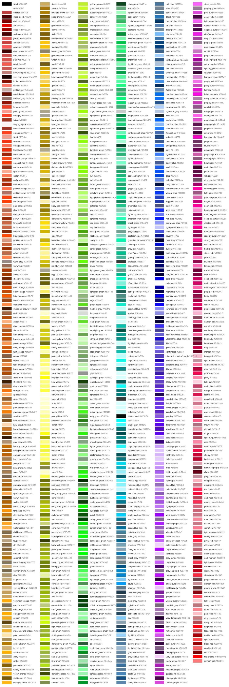
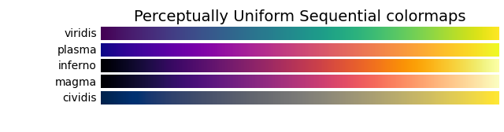
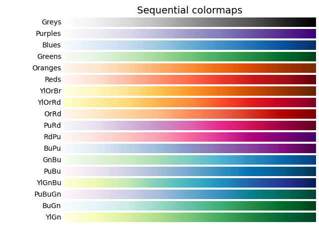
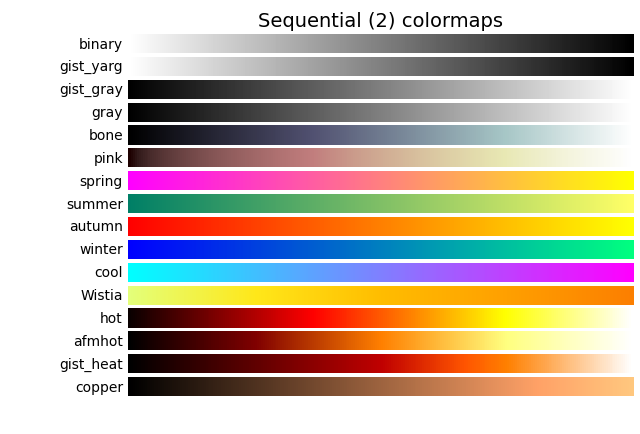
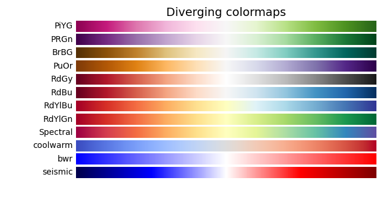
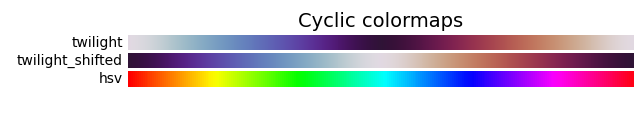
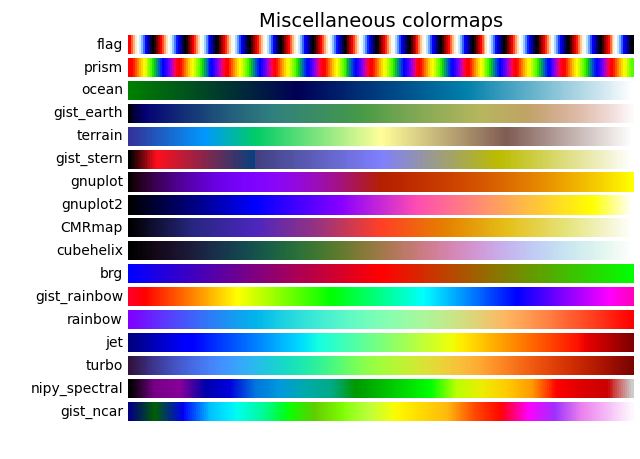

# $Color$

[TOC]

# Colors



[The 954 most common RGB monitor colors, as defined by several
hundred thousand participants in the xkcd color name survey.](https://xkcd.com/color/rgb/)

# Color Model

## RGB Color Model

  - Define

    $$
    \{Red, Green, Blue\}
    $$

    The RGB color model is an additive color model in which the red, green and blue primary colors of light are added together in various ways to reproduce a broad array of colors.

  - Physical principles for the choice of red, green, and blue: Young–Helmholtz theory

    The choice of primary colors is related to the physiology of the human eye; good primaries are stimuli that maximize the difference between the responses of the cone cells of the human retina to light of different wavelengths, and that thereby make a large color triangle.

  - Representation

    $$
    \boldsymbol c = (r, g, b)^T , a, b,c \in [0, 1]
    $$

    The RGB color could be represented as a vector $c \in [0, 1]^3$. 

    ```c
    c = r << 0 |
        g << 8 | 
        e << 16;
    ```

    In computer science, the primary colors in the RGB color model are often discretized as integers ranging $(0, \text{0xFF})$. This range allows for 8 bits of precision per color component, resulting in $256$ possible intensity levels for each primary color (red, green, and blue). And the color can be represented as an integers ranging $(0, \text{0xFFFFFF})$ by directly concatenating integers of primary colors.

  - Color Operation

    | | |
    | ------- | ------------------------------------------------------ |
    | `inv` | $\boldsymbol 1 - \boldsymbol c$ |
    | `lighten` | $\max(\boldsymbol c_1, \boldsymbol c_2)$               |
    | `darken` | $\min(\boldsymbol c_1, \boldsymbol c_2)$               |
    | `add`  | $\min(\boldsymbol c_1 + \boldsymbol c_2, \boldsymbol 1)$ |
    | `sub` | $\max(\boldsymbol c_1 - \boldsymbol c_2, \boldsymbol 0)$ |
    | `average` | $(\boldsymbol c_1 + \boldsymbol c_2) / 2$ |


## HSV Color Model

  - Define

    $$
    \{Hue, Saturation, Value\}
    $$

    $$
    Hue \in [0. 2\pi], Saturation, Value \in [0,1]
    $$

    - Hue, represents the dominant wavelength of light that we perceive as color. 

      | Hue  | Color |
      | ---- | ----- |
      | 0    | Red   |
      | 120  | Green |
      | 240  | Blue  |
    
    - Saturation,  represents the intensity or purity of a color. A saturation of 0% represents a completely desaturated color (grayscale), while a saturation of 100% represents a fully saturated color. Values in between create various levels of intensity.
    
    - Value (Brightness), represents the brightness or lightness of a color. A value of 0% corresponds to black, while a value of 100% corresponds to the maximum brightness of a color.

## Convert

### RGB $\to$ HSV 
$$
\begin{align}
  V & = \max(R, G, B)\\
  S &= \left\{\begin{matrix}
    0 & ,\text{if }  V = 0 \\
    \frac{\max(RGB) - \min(RGB)}{V}  & , \text{otherwise}
  \end{matrix}\right.  \\
  H & = \left\{\begin{matrix}
    0 & ,\text{if }  C = R\\ 
    60 \degree \cdot (\frac{G - B}{\max(RGB) - \min(RGB)}  \mod 6) & ,\text{if } V = R \\ 
    60 \degree \cdot (\frac{B - R}{\max(RGB) - \min(RGB)} + 2) & , \text{if } V = G \\  
    60 \degree \cdot (\frac{R - G}{\max(RGB) - \min(RGB)} + 4) & , \text{if } V = B \\  
  \end{matrix}\right.
\end{align}
$$

### HSV $\to$ RGB
$$
\begin{align}
  C &= V \cdot S  \tag{chroma}\\
  X &= C \cdot \left(1 - \left|\frac{H}{60 \degree} \mod 2 - 1\right|\right)\\
  (R, G, B) &= \left\{\begin{matrix}
    (C, X, 0) & \text{if } 0 \le \frac{H}{60 \degree} < 1  \\
    (X, C, 0) & \text{if } 1 \le \frac{H}{60 \degree} < 2  \\
    (0, C, X) & \text{if } 2 \le \frac{H}{60 \degree} < 3  \\
    (0, X, C) & \text{if } 3 \le \frac{H}{60 \degree} < 4  \\
    (X, 0, C) & \text{if } 4 \le \frac{H}{60 \degree} < 5  \\
    (C, 0, X) & \text{if } 5 \le \frac{H}{60 \degree} < 6  \\
  \end{matrix}\right.
\end{align}
$$


# Spectrum













```cpp
inline ARGB spectrum(double value, vector<vector<double>>& colors) {
    double position = value * (colors.size() - 1);
    int idx = static_cast<int>(position);
    double alpha = 1 - (position - idx);

    return RGB::Alpha(RGB::to_ARGB(colors[idx][0],     colors[idx][1],     colors[idx][2]),
                      RGB::to_ARGB(colors[idx + 1][0], colors[idx + 1][1], colors[idx + 1][2]), 
                      alpha);
}
```


# Reference

- Nathan Moinvaziri at https://stackoverflow.com/questions/5919663/how-does-photoshop-blend-two-images-together

  ​    
