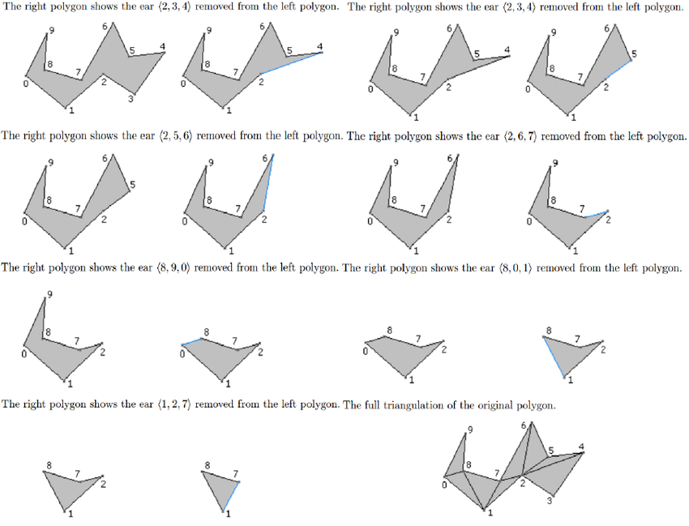

# $Ear\ Clipping$
[TOC]
## Purpose
The ear clipping algorithm is a simple and efficient method for triangulating simple polygon. The algorithm takes as input an $n$-sided polygon and produces a list of $n-2$ triangular faces that form the triangulated polygon.

- Input: a polygon (represented by a set of points).

- Output: a set of triangles.
  
## Idea

- **Ear**: An ears is a triangle form by three consecutive vertices of the polygon, such that the triangle is entirely contained whitin the polygon and no other vertices of the polygon are inside the triangle.

- Identify and remove "ears" from the polygon. 

## Process



- **Find an Ear:**

  - Start with any vertex of the polygon

  - judge a vertice whether is a reflex or convex vertice.
    $$det(b - a, c - b) = (b_x - a_x) (c_y - b_y) - (c_x - b_x) (b_y - a_y) > 0$$

    Due to an input polygon is in most cases a list of consecutive vertices, and represent the polygon in counter clockwise order. Therefore, when walking along the boundary of the polygon the interior of it should be to the left of evert edge traversed.

    The determinate gives us as result greater than zero if the vertice $a, b, c$ form a convex angle at $b$; and less than zero otherwise.

    (reference: https://stackoverflow.com/questions/40410743/polygon-triangulation-reflex-vertex)

    ```cpp
    inline bool isEar(Point& a, Point& b, Point& c, vector<Point>& polygon) {
        static std::function<double(Point&, Point&, Point&)> crossProduct =
            [](Point& a, Point& b, Point& c) {
            return
                (b[0] - a[0]) * (c[1] - b[1]) -
                (b[1] - a[1]) * (c[0] - b[0]);
        };
    
        // if not a convex vertice
        if (crossProduct(a, b, c) < 0)
            return false;
    
        for (Point p : polygon) {
            if ((p[0] == a[0] && p[1] == a[1]) ||
                (p[0] == b[0] && p[1] == b[1]) ||
                (p[0] == c[0] && p[1] == c[1]))
                continue;
    
            // if in trangle
            if (crossProduct(a, b, p) > 0 &&
                crossProduct(b, c, p) > 0 &&
                crossProduct(c, a, p) > 0
            )
                return false;
        }
        return true;
    }
    ```

    

- **Remove the Ear:**

  Once we find an "ear," we remove the vertex from the polygon and create a triangle. The resulting polygon has one fewer vertex.

- **Repeat:**

  Continue the process with the updated polygon (with one less vertex) until no vertices are left. The algorithm terminates when the entire polygon has been triangulated.

