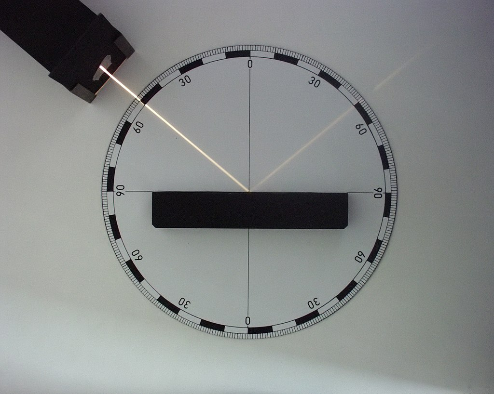
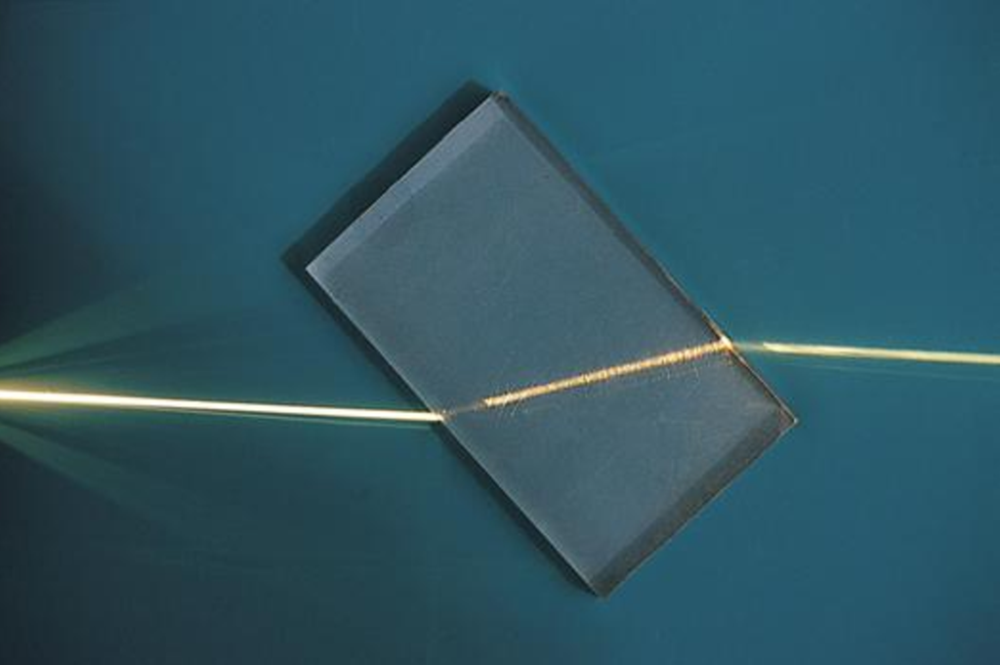
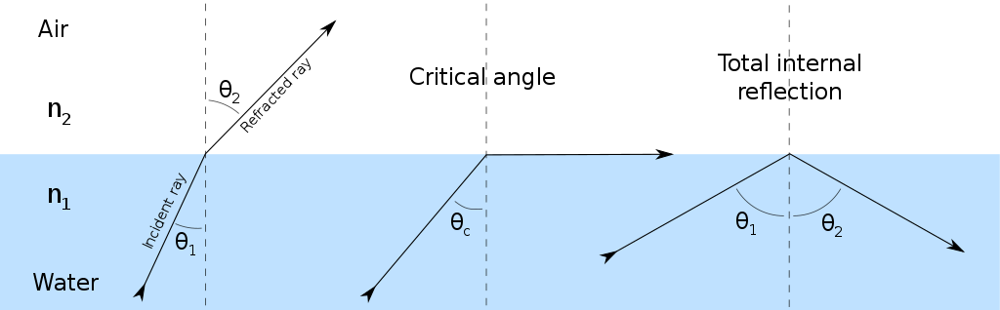

# $Geometric\ Optics$
[TOC]
# Basic Principles
- Light propagates in a straight line.
- Light paths are reversible.
- When two beams of light propagate without interference and converge at the same point, their intensities simply add up.
- Laws of light propagation at the interface between media.

# Light Propagation in Dielectric Interfaces
## Reflection

**Specular reflection** states that a reflected ray of light emerges from the reflecting surface at the same angle to the surface normal as the incident ray, but on the opposing side of the surface normal in the plane formed by the incident and reflected rays.
$$
θ_i = θ_o
$$

### Reflected ray calculation

$$
\boldsymbol L_o = \boldsymbol L_i - 2 (\boldsymbol N · \boldsymbol L_i) \boldsymbol N
$$

Where:
- $\boldsymbol L_o$ is the outgoing (reflected) light direction.
- $\boldsymbol L_i$ is the incoming (incident) light direction.
- $\boldsymbol N$ is the surface normal at the point of reflection.
- $\cdot$ represents the dot product between two vectors.

## Refraction
$$
n_i·\sin θ_i = n_o·\sin θ_o
$$

### Total internal reflection

Total internal reflection is a phenomenon that occurs when a ray of light traveling from a denser medium to a less dense medium is incident on the boundary between the two media at an angle of incidence greater than the critical angle. When this happens, instead of the light refracting (bending) as it normally would when passing from one medium to another, all of the light is reflected back into the denser medium.

### Refraction ray calculation
$$
\boldsymbol L_o = \boldsymbol L_i + \boldsymbol N· \left(\cos θ_i - \frac{\sqrt{1 - n^2·\sin^2 θ_i}}{n}\right)
$$
面矢$\boldsymbol N$, 入射光$\boldsymbol L_i$, 出射光$L_o$, 折射率 $n = \frac{n_i}{n_o}$, 折射角$ θ_i = <\boldsymbol L, \boldsymbol N>$

- Proof  
    $$
    \begin{align*}
    \boldsymbol L_o 
      &= \boldsymbol L_i + \boldsymbol N·\frac{\sin(θ_o - θ_i)}{\sinθ_o}  \\
      &= \boldsymbol L_i + \boldsymbol N· \frac{\cos θ_i·\sinθ_o - \cos θ_o·\sinθ_i}{\sinθ_o}  \\
      &= \boldsymbol L_i + \boldsymbol N· (\cos θ_i - \frac{\cos θ_o}{n})  \\
      &= \boldsymbol L_i + \boldsymbol N· (\cos θ_i - \frac{\sqrt{1 - n^2·\sin^2θ_i}}{n})  \\
    \end{align*}
    $$

### Example
* Convex lens
  - Define
    边缘薄、中间厚的透镜. 主要对光起会聚的作用.
  - Property
    - 物距 $u > 2 F$, 像距$v \in (F, 2F)$, 倒立缩小的实像, 物像异侧.
    - 物距 $u = 2 F$, 像距$v = 2 F$, 倒立等大的实像, 物像异侧.
    - 物距 $u \in (F, 2F)$, 像距$v > 2 F$, 倒立放大的实像, 物像异侧.
    - 物距 $u = F$, 不成像.
    - 物距 $u < f$, 像距$v > F$, 正立放大的虚像, 物像同侧.
* Concave lens

## Diffuse Reflection

Diffuse reflection is the reflection of light or other waves or particles from a surface such that a ray incident on the surface is scattered at many angles rather than at just one angle as in the case of specular reflection.

### Diffuse Reflection ray calculation

在面矢半球内, 面积均匀的随机取一射线, 作为反射光线.

# Fog  
## Fog model
$$
L_o(x) = L_i(x) · t(x) + A · (1 - t(x))
$$
$L_o(x)$ 观测到的亮度, $L_i(x)$ 原始无雾时亮度, $t(x)$ 透射率, $A$大气光亮度. 

当大气密度、成分是均匀同质时, 透射率 $t(x) = e^{-\beta d(x)}$

# [Illumination Model](./Illumination_Model.md)

