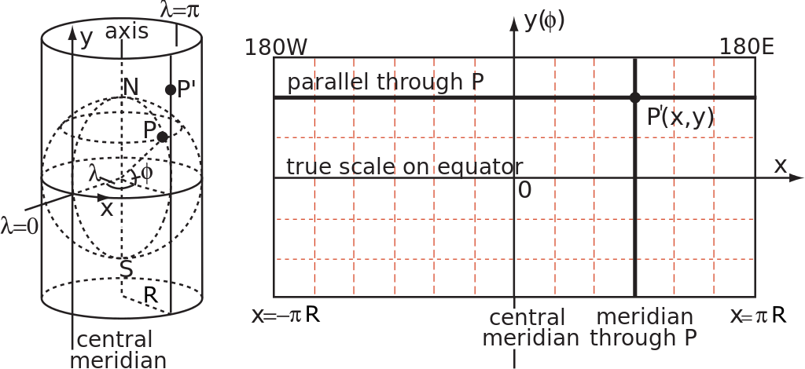
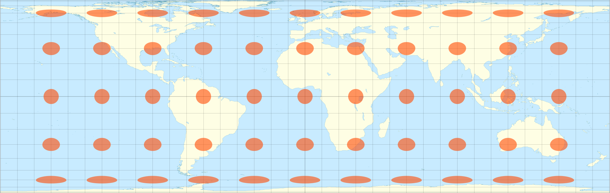
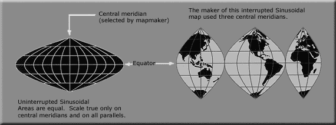
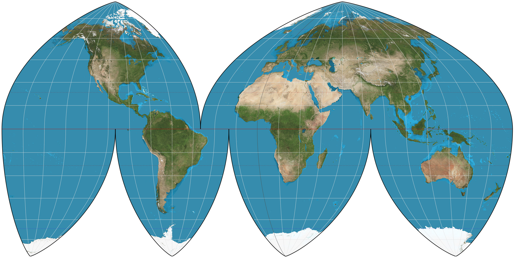
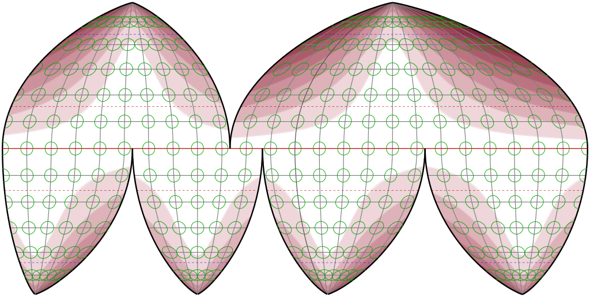

# $Map\ Projection$

[TOC]

Map Projection is the process of converting a 3D sphere into a 2D plane. Representing sphere on a flat plane inevitably introduces some distortions in properties such as distance, area, shape, or direction. Different map projections are designed to preserve certain properties while sacrificing others, depending on the specific purpose and area of interest.

# Classification by method
## Cylindrical Projection

### Mercator Projection

$$
X = \lambda  \\
Y = \ln(\tan(\frac{\pi}{4} + \frac{\phi}{2}))
$$

### Lambert Cylindrical Projection

$$
X = \lambda  \\
Y = \sin(\phi)
$$

## Pseudocylindrical Projection

### Mollweide projection

The Mollweide projection is an equal-area, pseudocylindrical projection in which the equator is represented as a straight horizontal line perpendicular to a central meridian that is one-half the equator's length. The other parallels compress near the poles, while the other meridians are equally spaced at the equator. The meridians at 90 degrees east and west form a perfect circle, and the whole earth is depicted in a proportional 2:1 ellipse. The proportion of the area of the ellipse between any given parallel and the equator is the same as the proportion of the area on the globe between that parallel and the equator, but at the expense of shape distortion, which is significant at the perimeter of the ellipse, although not as severe as in the sinusoidal projection.

### Sinusoidal projection

### Boggs eumorphic projection

Boggs generally repeated regions in two different lobes of the interrupted map in order to show Greenland or eastern Russia undivided.

## Conic Projection.

### Lambert Conformal Conic Projection

$$
X = \rho \sin(\lambda - \lambda_0)  \\
Y = \rho_0 - \rho \cos(\lambda - \lambda_0)
$$

## Azimuthal Equidistant Projection

$$
X = R \cos(\phi) \sin(\lambda - \lambda_0)  \\
Y = R \left(\cos(\phi_0) \sin(\phi) - \sin(\phi_0) \cos(\phi) \cos(\lambda - \lambda_0)\right)
$$

# Classification by characteristic
## Equal-distance Projection

## Equal-area Projection

- Azimuthal
    - Lambert azimuthal equal-area
    - Wiechel

- Conic
    - Albers
    - Lambert equal-area conic projection

- Pseudoconical
    - Bonne
    - Bottomley
    - Werner

- Cylindrical
    - Lambert cylindrical equal-area (0°)
    - Behrmann (30°)
    - Hobo–Dyer (37°30′)
    - Gall–Peters (45°)

- Pseudocylindrical
    - Boggs eumorphic
    - Collignon
    - Eckert II, IV and VI
    - Equal Earth
    - Goode's homolosine
    - Mollweide
    - Sinusoidal
    - Tobler hyperelliptical
- Eckert-Greifendorff
- McBryde-Thomas Flat-Polar Quartic Projection
- Hammer
- Strebe 1995
- Snyder equal-area projection
