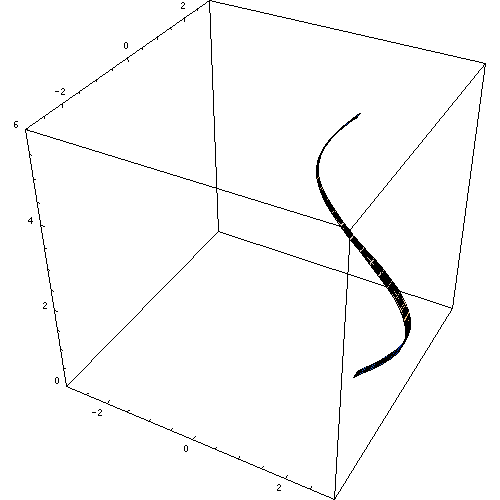

# $Modeling$

[TOC]

# To Point Set

## Fibonacci lattice

# To Triangle Set (Triangulation)

## Delaunay Triangulation: 2D Point Set $\to$ Triangle Set

## Ear Clipping: 2D Polygon $\to$ Triangle Set

[Ear Clipping](./Ear_Clipping.md)

## Marching Cubes: Function $\to$ Triangle Set

[Marching Cubes](./Marching_Cubes.md)

# Solid of revolution

In geometry, a solid of revolution is a solid figure obtained by rotating a plane figure around some straight line (the axis of revolution), which may not intersect the generatrix (except at its boundary). The surface created by this revolution and which bounds the solid is the surface of revolution.

**Prismatic Body**

如果一个平面区域沿着一条直线（不必与该平面平行）进行直线平移，它会在空间中扫出一个三维的形状。这个形状被称为平移体。例如，当你沿着一条直线移动一个矩形，你会得到一个长方体。

