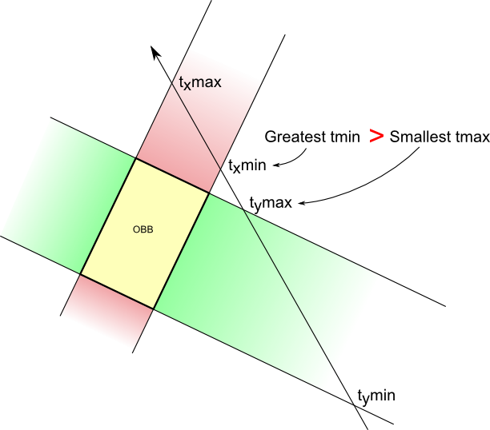

# $Ray\ Tracing$

[TOC]

# 场景描述

在光线追踪中，场景由对象、光源和摄像机组成。首先，需要定义场景的描述数据结构，包括：

- 几何对象（球体、平面、三角形等）
- 材质属性（颜色、反射率、折射率等）
- 光源（点光源、平行光源等）
- 摄像机参数（位置、方向、视野等）

## Geometric Objects

几何对象代表了场景中的可渲染物体，如球体、平面、三角形等。每个几何对象都有以下属性：

- 位置：对象的中心点或顶点。
- 形状：对象的形状，可以是球体、立方体、自定义形状等。
- 几何信息：根据对象的形状，可能包括半径、边长、顶点位置等。
- 旋转和缩放：对象可能会被旋转或缩放，影响其形状和位置。

## Material Properties

材质属性定义了几何对象表面的外观特性，如颜色、反射率、折射率等。每个几何对象可以关联一个材质，材质属性包括：

- 颜色：表面的基本颜色。
- 反射率（反射颜色）：表面对光的反射程度，可以是漫反射、镜面反射等。
- 折射率（透明度）：用于处理折射和透明材质。
- 纹理映射：可以附加纹理贴图，使表面更具细节和复杂性。

## Light Sources

光源定义了场景中的光照。在光线追踪中，常见的光源类型包括点光源、平行光源等。每个光源具有以下属性：

- 位置和方向：光源的位置或光线的方向。
- 光强度和颜色：光源的亮度和颜色。
- 光源类型：光源可以是点光源（发射光线从一点扩散）、平行光源（光线平行）等。

## Camera Parameters

摄像机定义了渲染的视角和投影方式。摄像机参数包括：

- 位置：摄像机的位置。
- 观察方向：摄像机观察的方向。
- 上方向：摄像机的上方向，通常与视角有关。
- 视野（FOV）：决定了摄像机视野的角度。
- 屏幕分辨率：渲染图像的分辨率。

# 光线-物体相交

实现光线与场景中的物体相交的算法。这包括了光线与物体表面的交点计算，以及确定光线是否被遮挡或穿过物体。

## Ray-Plane Intersection

$$\mathbf{P}(t) = \mathbf{O} + t\mathbf{D}$$

Where �**O** is the origin and �**D** is the direction of the ray.

A plane can be represented by:

$$\mathbf{N} \cdot (\mathbf{P} - \mathbf{P}_0) = 0$$
$$
\begin{align*}
a & = \mathbf{D} \cdot \mathbf{D} \\
b & = 2\mathbf{D} \cdot (\mathbf{O} - \mathbf{C}) \\
c & = (\mathbf{O} - \mathbf{C}) \cdot (\mathbf{O} - \mathbf{C}) - r^2
\end{align*}
$$

## Ray-Sphere Intersection

## Ray-Triangle Intersection

## Ray-AABB-Box Intersection

# 光线追踪算法

实现光线追踪算法的主要循环，该循环包括以下步骤：

- 为每个像素生成一条射线（从摄像机出发）
- 对于每条射线，与场景中的物体进行相交检测
- 计算反射和折射光线（如果适用）
- 计算光照强度和颜色
- 递归追踪阴影光线
- 累积颜色值，用于最终的图像渲染

# 阴影计算

实现阴影计算，以确定场景中的物体是否受到光源的直接照射。这涉及到发射阴影光线并检测光线是否与其他物体相交。

# 反射和折射

实现反射和折射光线的计算，以处理反射和透明物体。这需要递归地调用光线追踪算法来计算反射和折射光线的颜色。

# 最终图像生成

将计算得到的颜色值转换为最终的图像。可以使用常见的图像格式（如PNG、JPEG）来保存渲染结果。

# 性能优化

考虑光线追踪的性能优化方法，如光线的加速数据结构（如BVH树）和多线程渲染。

# 用户界面

实现用户界面，允许用户输入场景描述参数、渲染设置（分辨率、采样率等）并查看渲染结果。

# 扩展功能

- 加入更复杂的材质和纹理映射
- 实现全局光照模型，如全局光照、辐射度估计等
- 支持更多的几何体类型
- 实现运动模糊、景深等效果

