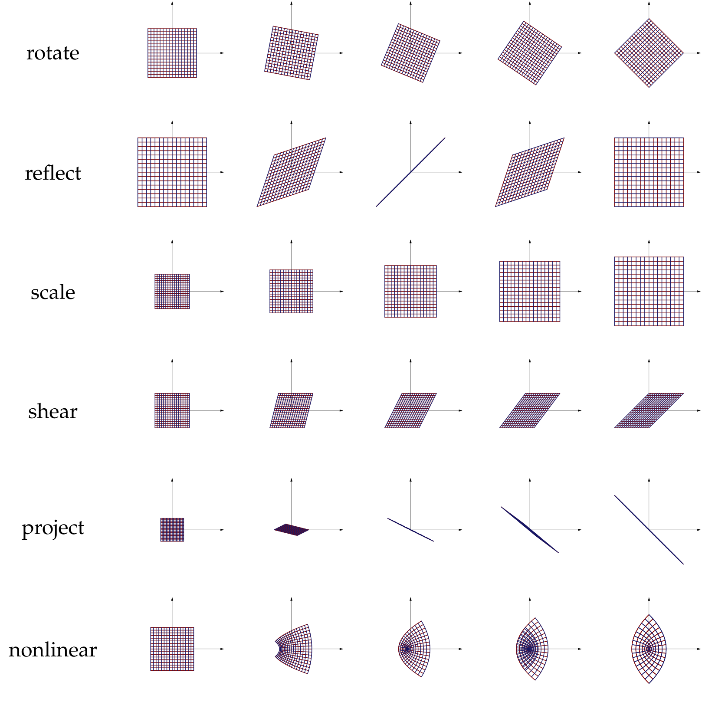

# $Transformation$

[TOC]

# Linear transformation

A **linear transformation** is a function from one vector space to another which satisfies $L(\alpha \boldsymbol v + \beta \boldsymbol w) = \alpha L(\boldsymbol v) + \beta L(\boldsymbol w)$. Geometrically, these are "flat maps": a function is linear if and only if it maps equally spaced lines to equally spaced lines or points.

## Translation

The translation is a linear transformation that shifts each point of a set by a consistent distance in a specified direction.
$$
T(\boldsymbol x) = \boldsymbol x + \boldsymbol b
$$

## Scaling 

Scaling is a transformation that enlarges or reduces a figure by a scale factor.
$$
T(\boldsymbol x) = \boldsymbol a \otimes \boldsymbol x
$$
## Reflection 

Reflection is a transformation that produces a mirror image of an object.
$$
T(\boldsymbol x) = \boldsymbol a \otimes \boldsymbol x, \boldsymbol a_i \in \{-1, 1\}
$$

## Rotation 

$$
T(\boldsymbol x, \theta, i, j) = \left(\begin{matrix} \cdots, x_i \cos(\theta) - y_i \sin(\theta), \cdots, x_k, \cdots, x_j \sin(\theta) + x_j\cos(\theta), \cdots \end{matrix}\right)
$$

$$
T(\theta, i, j) = \left(\begin{matrix} 
1 &&&&&& \boldsymbol 0\\
& \ddots\\
&& \cos(\theta)_{(i, i)} && -\sin(\theta)_{(i, j)} \\
&&& \ddots \\
&& \sin(\theta)_{(j, i)} && \cos(\theta)_{(j, j)}  \\
&&&&& \ddots \\
\boldsymbol 0 &&&&&& 1
\end{matrix}\right)
$$

## Shearing 

Shearing is a transformation that distorts the shape of an object.
$$
T(x, y) = (x + k y, y)
$$

## Projection

Projection is a transformation that maps a point in space onto a plane or line.
$$
T(\boldsymbol x) = ProjV(\boldsymbol x)
$$

# Analytic Function Transformation

## Exponential Transformation

$$
T(x) = e^x
$$

# Map Projection

[Map Projection](./Map_Projection.md)

# Other Transformations

### Fractional Linear Transformation

This is a transformation of the complex plane, which is a combination of inversion, translation, scaling, and rotation.
