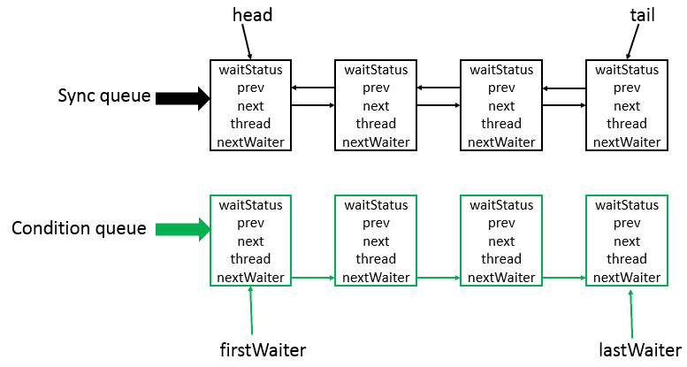

[TOC]

# Java

## 对象内存结构&填充的作用

[Java对象的内存布局 - JaJian - 博客园 (cnblogs.com)](https://www.cnblogs.com/jajian/p/13681781.html)

### 对象头

- Mark Word
  - **锁标志位（lock）**：区分锁状态，11时表示对象待GC回收状态, 只有最后2位锁标识(11)有效。
  - **biased_lock**：是否偏向锁，由于无锁和偏向锁的锁标识都是 01，没办法区分，这里引入一位的偏向锁标识位。
  - **分代年龄（age）**：表示对象被GC的次数，当该次数到达阈值的时候，对象就会转移到老年代。
  - **对象的hashcode（hash）**：运行期间调用System.identityHashCode()来计算，延迟计算，并把结果赋值到这里。当对象加锁后，计算的结果31位不够表示，在偏向锁，轻量锁，重量锁，hashcode会被转移到Monitor中。
  - **偏向锁的线程ID（JavaThread）**：偏向模式的时候，当某个线程持有对象的时候，对象这里就会被置为该线程的ID。 在后面的操作中，就无需再进行尝试获取锁的动作。
  - **epoch**：偏向锁在CAS锁操作过程中，偏向性标识，表示对象更偏向哪个锁。
  - **ptr_to_lock_record**：轻量级锁状态下，指向栈中锁记录的指针。当锁获取是无竞争的时，JVM使用原子操作而不是OS互斥。这种技术称为轻量级锁定。在轻量级锁定的情况下，JVM通过CAS操作在对象的标题字中设置指向锁记录的指针。
  - **ptr_to_heavyweight_monitor**：重量级锁状态下，指向对象监视器Monitor的指针。如果两个不同的线程同时在同一个对象上竞争，则必须将轻量级锁定升级到Monitor以管理等待的线程。在重量级锁定的情况下，JVM在对象的ptr_to_heavyweight_monitor设置指向Monitor的指针。

**对齐数据**
对象可以有对齐数据也可以没有。默认情况下，Java虚拟机堆中对象的起始地址需要对齐至8的倍数。如果一个对象用不到8N个字节则需要对其填充，以此来补齐对象头和实例数据占用内存之后剩余的空间大小。如果对象头和实例数据已经占满了JVM所分配的内存空间，那么就不用再进行对齐填充了。

所有的对象分配的字节总SIZE需要是8的倍数，如果前面的对象头和实例数据占用的总SIZE不满足要求，则通过对齐数据来填满。

**为什么要对齐数据？**

字段内存对齐的其中一个原因，是让字段只出现在同一CPU的缓存行中。如果字段不是对齐的，那么就有可能出现跨缓存行的字段。也就是说，该字段的读取可能需要替换两个缓存行，而该字段的存储也会同时污染两个缓存行。这两种情况对程序的执行效率而言都是不利的。其实对其填充的最终目的是为了计算机高效寻址。

## epoll 的底层原理

[linux内核Epoll 实现原理 - jame_xhs's blog (jxhs.me)](https://www.jxhs.me/2021/04/08/linux内核Epoll-实现原理/)

## GC Root  标准

[JVM三色标记法详解，带“颜色”的JVM - 知乎 (zhihu.com)](https://zhuanlan.zhihu.com/p/431406707)

## G1 为什么比 CMS 更适合服务器

[JVM三色标记法详解，带“颜色”的JVM - 知乎 (zhihu.com)](https://zhuanlan.zhihu.com/p/431406707)

[看完这篇垃圾回收，和面试官扯皮没问题了（现在点外卖是天价！） (qq.com)](https://mp.weixin.qq.com/s?__biz=MzAwNDA2OTM1Ng==&mid=2453141471&idx=2&sn=f1f8cf98ad0d0b4d3a9e328c3378b2e6&scene=21#wechat_redirect)

**G1（Garbage First） 收集器**
G1 收集器是面向服务端的垃圾收集器，被称为驾驭一切的垃圾回收器，主要有以下几个特点

- 像 CMS 收集器一样，能与应用程序线程并发执行。

- 整理空闲空间更快。
- 需要 GC 停顿时间更好预测。
- 不会像 CMS 那样牺牲大量的吞吐性能。
- 不需要更大的 Java Heap

与 CMS 相比，它在以下两个方面表现更出色

- 运作期间不会产生内存碎片，G1 从整体上看采用的是标记-整理法，局部（两个 Region）上看是基于复制算法实现的，两个算法都不会产生内存碎片，收集后提供规整的可用内存，这样有利于程序的长时间运行。
- 在 STW 上建立了可预测的停顿时间模型，用户可以指定期望停顿时间，G1 会将停顿时间控制在用户设定的停顿时间以内。

## GC 和 JVM 安全点、安全域是什么？

[浅谈 JVM GC 的安全点与安全区域 - 小新是也 - 博客园 (cnblogs.com)](https://www.cnblogs.com/chenchuxin/p/15259439.html)

**安全点**
OopMap 的更新，从直观上来说，需要在对象引用关系发生变化的时候修改。不过导致引用关系变化的指令非常多，如果对每条指令都记录 OopMap 的话 ，那将会需要大量的额外存储空间，空间成本就会变得无法忍受的高昂。选用一些特定的点来记录就能有效的缩小需要记录的数据量，这些特定的点就称为 安全点 (Safepoint)。

有了安全点，当 GC 回收需要停止用户线程的时候，将设置某个中断标志位，各个线程不断轮询这个标志位，发现需要挂起时，自己跑到最近的安全点，更新完 OopMap 才能挂起。这主动式中断的方式是绝大部分现代虚拟机选择的方案，另一种抢占式就不介绍了。

安全点不是任意的选择，既不能太少以至于让收集器等待时间过长，也不能过多以至于过分增大运行时的内存负荷。通常选择一些执行时间较长的指令作为安全点，如方法调用、循环跳转和异常跳转等。

**安全区域**
使用安全点的设计似乎已经完美解决如何停顿用户线程，让虚拟机进入垃圾回收状态的问题了。但是，如果此时线程正处于 Sleep 或者 Blocked 状态，该怎么办？这些线程他不会自己走到安全点，就停不下来了。这个时候，安全点解决不了问题，需要引入 安全区域 (Safe Region)。

安全区域指的是，在某段代码中，引用关系不会发生变化，线程执行到这个区域是可以安全停下进行 GC 的。因此，我们也可以把 安全区域 看做是扩展的安全点。

当用户线程执行到安全区域里面的代码时，首先会标识自己已经进入了安全区域。那样当这段时间里虚拟机要发起 GC 时，就不必去管这些在安全区域内的线程了。当线程要离开安全区域时，它要检查虚拟机是否处于 STW 状态，如果是，则需要等待直到恢复。

# 锁机制

## Java 中的所有锁

[Java并发 - Java中所有的锁 | Java 全栈知识体系 (pdai.tech)](https://pdai.tech/md/java/thread/java-thread-x-lock-all.html)

- 乐观锁 VS 悲观锁
- 自旋锁 VS 适应性自旋锁
- 无锁 VS 偏向锁 VS 轻量级锁 VS 重量级锁
- 公平锁 VS 非公平锁
- 可重入锁 VS 非可重入锁
- 独享锁(排他锁) VS 共享锁

## Java 对象头与锁机制

见上文

## synchronized 用法&底层

[关键字: synchronized详解 | Java 全栈知识体系 (pdai.tech)](https://pdai.tech/md/java/thread/java-thread-x-key-synchronized.html)

## 乐观锁与CAS机制 （Unsafe & 自旋锁）

## 锁膨胀: 无锁 VS 偏向锁 VS 轻量级锁 VS 重量级锁

[无锁 VS 偏向锁 VS 轻量级锁 VS 重量级锁](https://pdai.tech/md/java/thread/java-thread-x-lock-all.html#3-无锁-vs-偏向锁-vs-轻量级锁-vs-重量级锁)

## AQS的两个队列

[JUC锁: 锁核心类AQS详解 | Java 全栈知识体系 (pdai.tech)](https://pdai.tech/md/java/thread/java-thread-x-lock-AbstractQueuedSynchronizer.html)

## AQS实现读写锁

## 线程池和阻塞队列实现

[自定义线程池_HardyZhan的博客-CSDN博客](https://blog.csdn.net/HardyZhan/article/details/126911089?spm=1001.2014.3001.5502)

# Spring

## AOP 是什么

## AOP 中的两个代理：Cglib vs. JDK代理

[JDK动态代理、Cglib 动态代理区别 - 掘金 (juejin.cn)](https://juejin.cn/post/6847902223813312526?from=search-suggest)

JDK 动态代理是实现了被代理对象的接口，Cglib是继承了被代理对象。

JDK  和Cglib 都是在运行期生成字节码，JDK是直接写Class字节码，Cglib使用ASM框架写Class字节码，Cglib代理实现更复杂，生成代理类方式比 JDK效率低。

JDK 调用代理方法，是通过反射机制调用，Cglib是通过 FastClass机制直接调用方法，Cglib执行效率更高。

同一个类中方法嵌套调用, 对内层方法增强 效果上区别

## Spring事务

# MySQL

## MVCC 和 ReadView原理

[事务隔离级别是怎么实现的？ | 小林coding (xiaolincoding.com)](https://www.xiaolincoding.com/mysql/transaction/mvcc.html#read-view-在-mvcc-里如何工作的)

## redolog 的底层

[MySQL 日志：undo log、redo log、binlog 有什么用？ | 小林coding (xiaolincoding.com)](https://www.xiaolincoding.com/mysql/log/how_update.html#redo-log-文件写满了怎么办)

## undolog 的底层

[MySQL必知必会：简介undo log、truncate、以及undo log如何帮你回滚事务 - 赐我白日梦 - 博客园 (cnblogs.com)](https://www.cnblogs.com/ZhuChangwu/p/14060916.html#十一事务是如何回滚的undo-log-链条)

## Buffer Pool 和 redo 缓存的过程

[揭开 Buffer Pool 的面纱 | 小林coding (xiaolincoding.com)](https://www.xiaolincoding.com/mysql/buffer_pool/buffer_pool.html#如何提高缓存命中率)

## 索引失效的场景

[15个必知的Mysql索引失效场景，别再踩坑了！ - 个人文章 - SegmentFault 思否](https://segmentfault.com/a/1190000041469451)

- 联合索引不满足最左匹配原则
- 使用了select *
- 索引列参与运算
- 索引列参使用了函数
- 错误的Like使用
- 类型隐式转换
- 使用OR操作
- 两列做比较
- 不等于比较
- is not null
- not in和not exists
- order by导致索引失效
- 参数不同导致索引失效
- Mysql优化器的其他优化策略，比如优化器认为在某些情况下，全表扫描比走索引快，则它就会放弃索引。

## 主从复制过程

## Redolog AOF 刷盘过程

# Redis

## Redis 的操作都是原子性

## 脑裂的解决过程

[Redis 的脑裂现象和解决方案_redis脑裂_盛夏温暖流年的博客-CSDN博客](https://blog.csdn.net/j1231230/article/details/121500055)

就是如果当前主库突然出现暂时性 “失联”，而并不是真的发生了故障，此时监听的哨兵会自动启动主从切换机制。当这个原始的主库从假故障中恢复后，又开始处理请求，但是哨兵已经选出了新的主库，这样一来，旧的主库和新主库就会同时存在，这就是**脑裂现象**。

**如何解决脑裂问题？**
Redis 中有两个关键的配置项可以解决这个问题，分别是 min-slaves-to-write（最小从服务器数） 和 min-slaves-max-lag（从连接的最大延迟时间）。

min-slaves-to-write 是指主库最少得有 N 个健康的从库存活才能执行写命令。

这个配置虽然不能保证 N 个从库都一定能接收到主库的写操作，但是能避免当没有足够健康的从库时，主库无法正常写入，以此来避免数据的丢失 ，如果设置为 0 则表示关闭该功能。

min-slaves-max-lag ：是指从库和主库进行数据复制时的 ACK 消息延迟的最大时间；

可以确保从库在指定的时间内，如果 ACK 时间没在规定时间内，则拒绝写入。

这两个配置项组合后的要求是，主库连接的从库中至少有 N 个从库，和主库进行数据复制时的 ACK 消息延迟不能超过 T 秒，否则，主库就不会再接收客户端的请求了。

这样一来，即使原主库是假故障，它在假故障期间也无法响应哨兵发出的心跳测试，也不能和从库进行同步，自然也就无法和从库进行 ACK 确认了。

此时的 min-slaves-to-write 和 min-slaves-max-lag 的组合要求就无法得到满足，原主库就会被限制接收客户端请求，客户端也就不能在原主库中写入新数据，就可以避免脑裂现象的发生了。

## 分布式锁实现：SETNX vs. RedLock

# Computer Networks

## 四次握手中的 Time_wait

