# $Micro\text{-}economics$

[TOC]

## Model

$$
consumers \overset{demand}{\Longleftarrow} markets \overset{supply}{\Longleftarrow} producers
$$

## $Quantity\text{-}Price$ relationship

- 经济学中，纵坐标是自变量，横坐标是因变量。

### $Q_d\text{-}P$: Demand curve

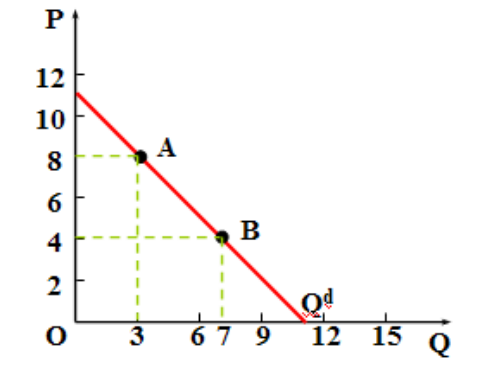

- 需求量的变化：曲线上移动
  - 当其他条件不变时，商品自身的价格变化会导致需求曲线上的点发生移动。

- 需求水平的变化：曲线的移动
  - 非价格因素包括消费者的收入水平、相关商品的价格、消费者偏好和消费者对商品价格的预期，当商品自身价格不变时，非价格因素变动会导致整条需求曲线的移动。
  - 替代品
  - 互补品

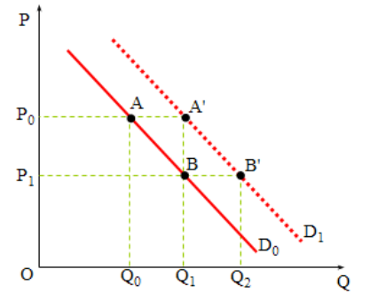

### $Q_s\text{-}P$: Supply curve

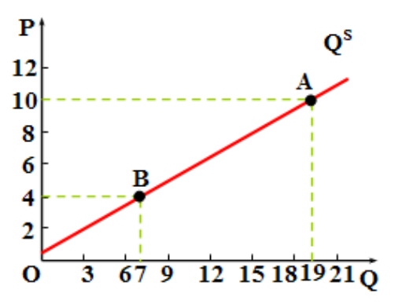

供给量的变化：曲线上移动

供给水平的变化：曲线的移动

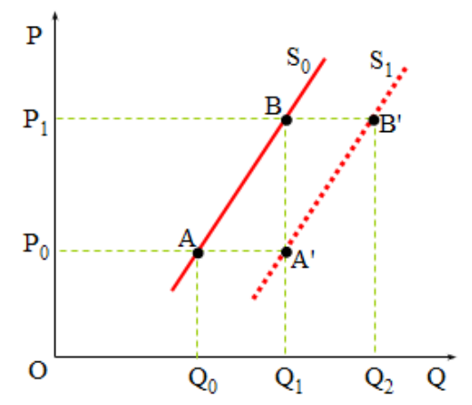

### $Price$: Supply-Demand Balance

$$
Q_d = Q_s
$$

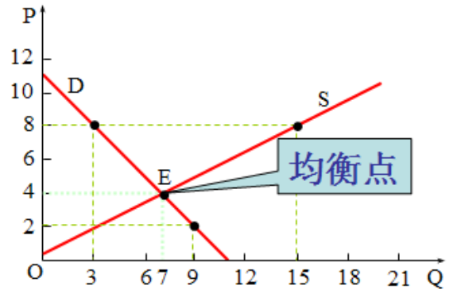

### $Elasticity$: Derivative with Normalized Units

$$
e = \frac{\frac{\Delta Y}{Y}}{\frac{\Delta X}{X}} = \frac{\Delta Y}{\Delta X}\frac{X}{Y}
$$

- 需求弹性

  - 需求弹性需要乘个负号

  - 反应需求量对价格变化的敏感程度。

    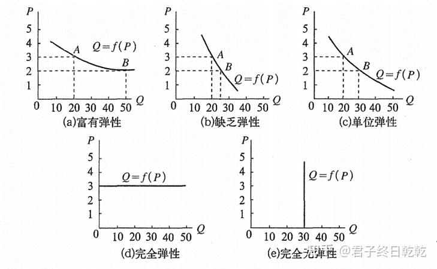

  - 销售收入 - 需求价格弹性

    - 富有弹性的商品，降价增加收入。
    - 缺乏弹性的商品，涨价增加收入。
    - 弹性等于1，价格变化，销售收入不变。
    - 无弹性商品，价格变化，销量不变，销售收入随价格同比例变化。
    - 例子：谷贱伤农

    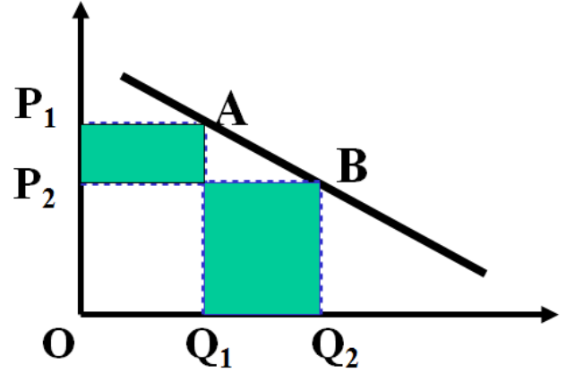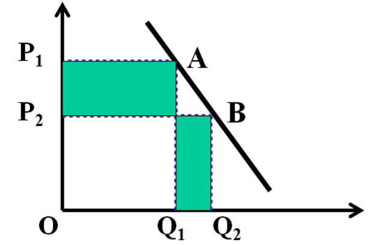

    

- 供给弹性

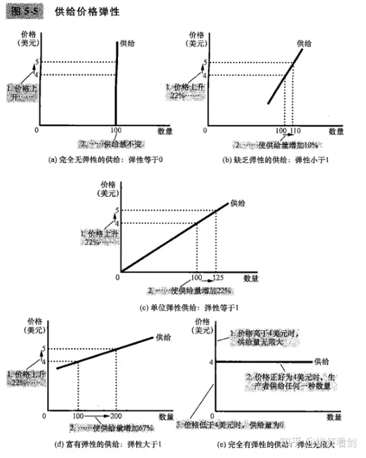

### $Tax$: Tax Wedge

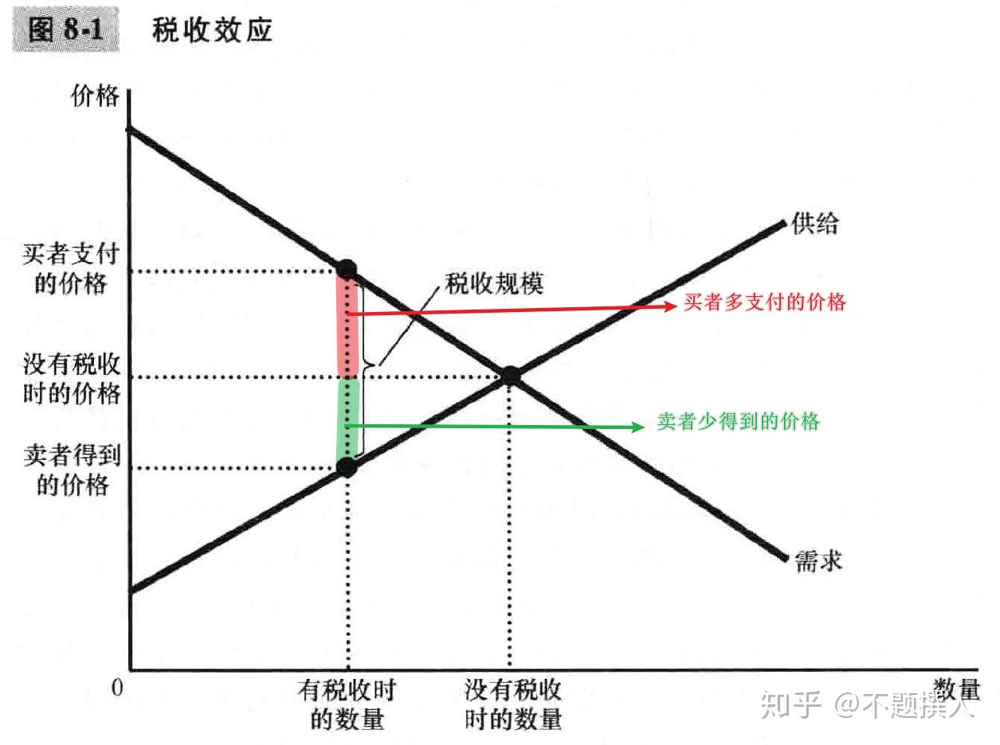

- 需求弹性和供给弹性决定了税收负担在买者和卖者之间的分摊。税收负担更多地落在缺乏弹性的市场一方身上。

  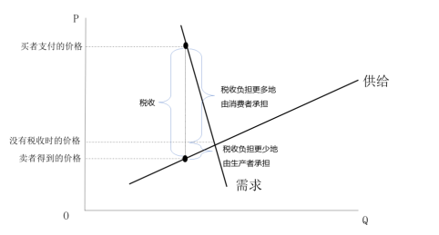

## Consumer

### 需求-收入

- 必需品的需求收入弹性大于0小于1
- 高档品的需求收入弹性大于1
- 吉芬商品的需求收入弹性小于0

### Utility

#### Cardinal Utility：Diminishing Marginal Utility

边际效用是效用的导函数

#### Ordinal Utility：$X_1\text{-}X_2$ Indifference Curve

### 预算

### 消费者均衡

- Normal goods：需求收入弹性为正
- Inferior goods：需求收入弹性为负
- Giffen goods

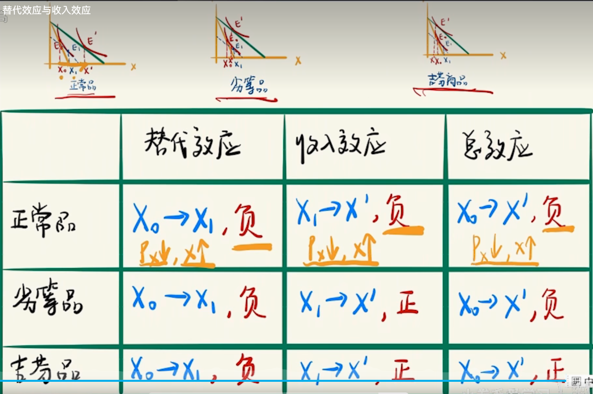

## Producer

### $Q-(L, F)$: 生产曲线

- Short-term 生产曲线 $Q = f(L)$
  - Law of Diminishing Marginal Returns
    当某种生产要素（例如，劳动力）在其他要素保持不变的情况下不断增加时，最初的增加可能会带来显著的增产，但随着这个要素的增加，每次增加都会产生越来越小的额外产出。这是因为其他要素保持不变，可能会导致资源配置不足或效率降低。

  - Total Product - Average Product - Marginal Product

    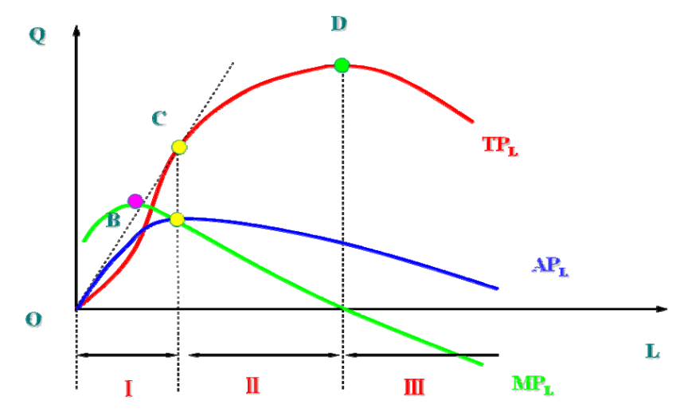
- 

### $C-Q$: Cost curve

- Short-term cost curve

  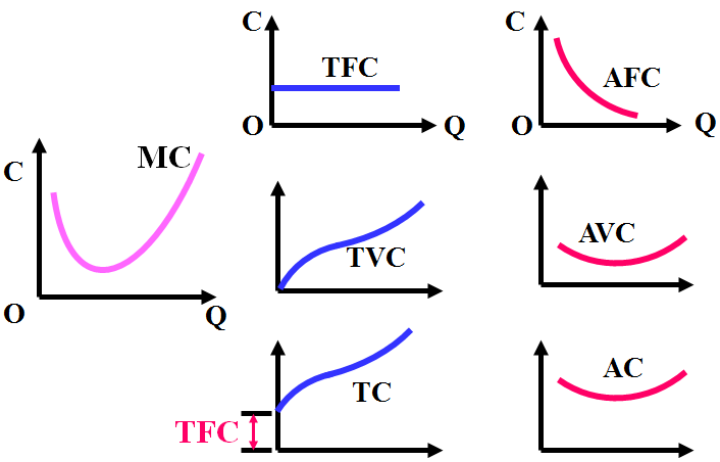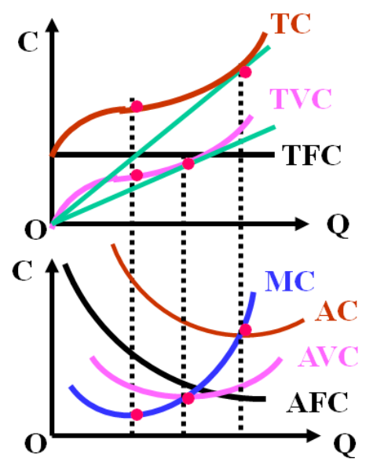

  - Average Cost - Average Variable Cost - Marginal Cost

    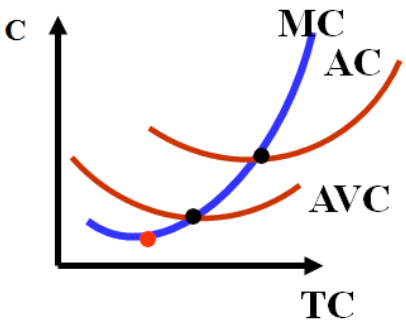

- Long-term cost curve
  - The long-run cost curve is the **envelope** of the short-run cost curves.

## Mackets

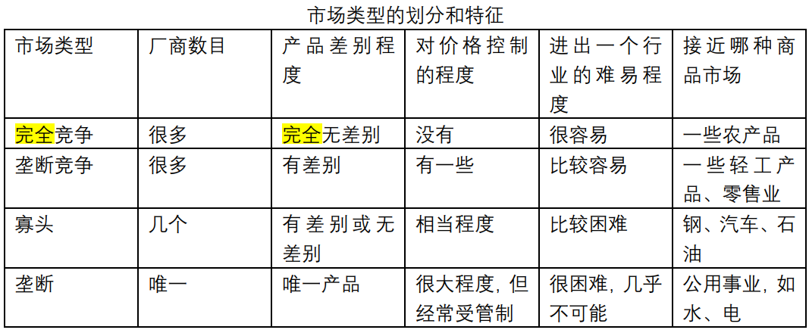

- Perfect Competition Market
- Perfect Monopoly Market
- Oligopoly Market

  - Cournot Model

- Market Failure
- Welfare Economics
